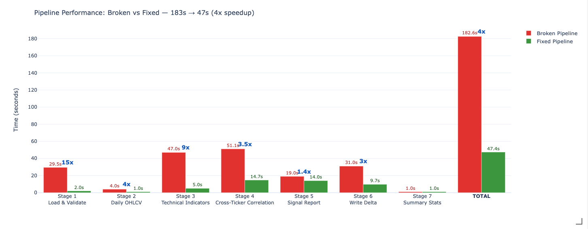
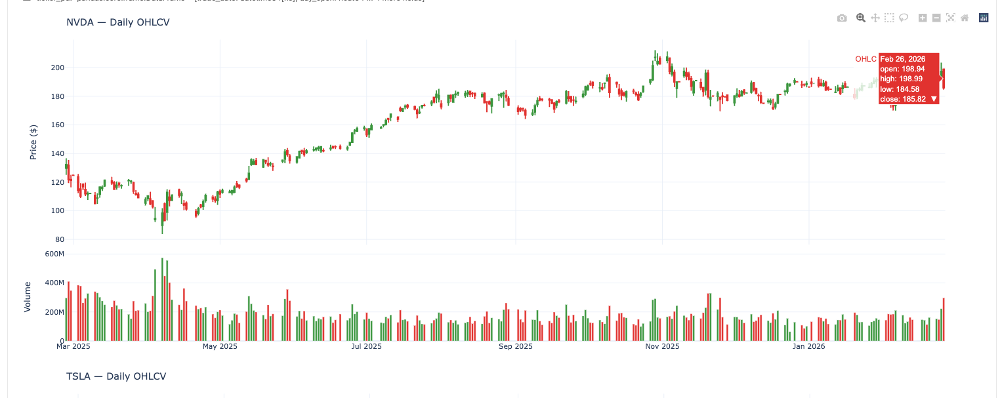
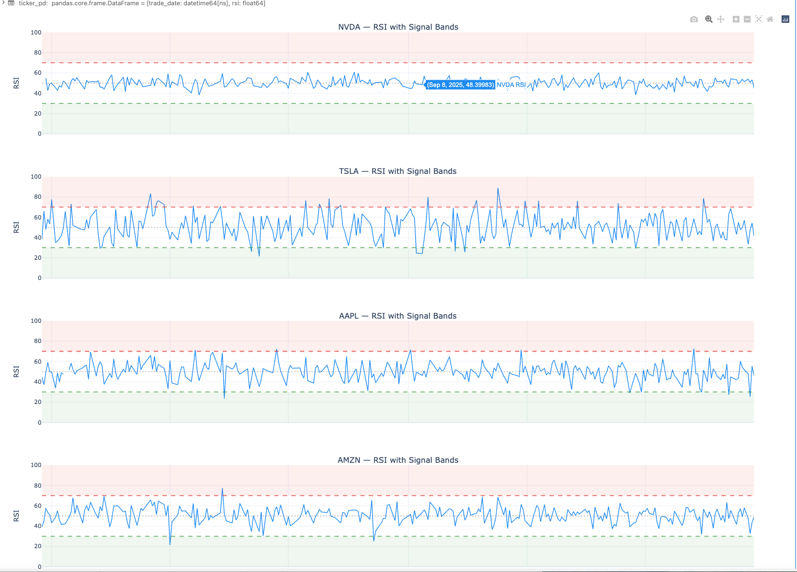
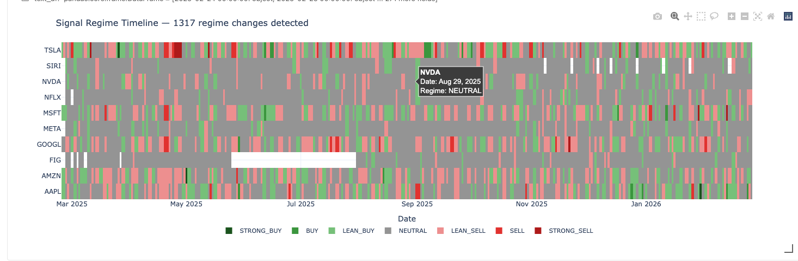
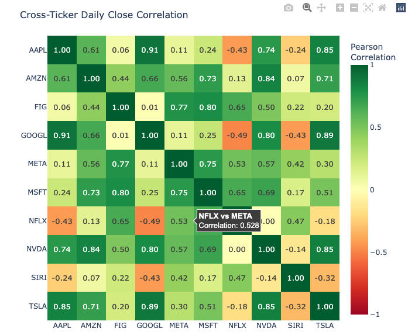

# Spark Stock Pipeline Optimisation

**PySpark performance engineering: 8 anti-patterns found and fixed in a stock signal pipeline — 4x faster, plus correctness bugs caught.**

A 7-stage PySpark pipeline that processes 1.7 million minute-level stock bars into daily trading signals. I profiled every stage, identified 8 performance anti-patterns, fixed them all, and discovered data correctness bugs the original silently missed.

---

## The Problem

The pipeline reads minute-level stock data (10 tickers, ~270 trading days, 1,719,450 bars from Polygon.io) and produces:

- **Daily OHLCV** — open/high/low/close/volume aggregation from minute bars
- **RSI (Relative Strength Index)** — momentum oscillator per ticker per day
- **Signal regime classification** — BUY, SELL, STRONG_BUY, STRONG_SELL, NEUTRAL, LEAN_BUY, LEAN_SELL
- **Cross-ticker correlation** — Pearson correlation of intraday price movements between all ticker pairs
- **Regime change detection** — identifies when a ticker's signal flips from one day to the next

The pipeline produces correct results, but is riddled with performance anti-patterns that would make it take hours (or OOM the cluster) on a production dataset.

---

## Results: Before vs After

All timings measured on Databricks Serverless compute.

| Stage | What It Does | Broken | Fixed | Speedup |
|-------|-------------|--------|-------|---------|
| 1 | Load & Validate | 29.49s | 2s | **15x** |
| 2 | Daily OHLCV Aggregation | 4s | 1s | **4x** |
| 3 | Technical Indicators (RSI + Signals) | 47s | 5s | **9x** |
| 4 | Cross-Ticker Correlation | 51.11s | 14.69s | **3.5x** |
| 5 | Signal Report (Regime Changes) | 19s | 14s | **1.4x** |
| 6 | Write to Delta Lake | 31s | 9.70s | **3x** |
| 7 | Summary Stats | 1s | 1s | — |
| **Total** | | **~183s** | **~47s** | **~4x** |

<!--  -->

---

## 8 Anti-Patterns Found & Fixed

| # | Stage | Anti-Pattern | Fix | Impact |
|---|-------|-------------|-----|--------|
| 1 | 1 | `collect()` pulls 1.7M rows to driver, Python loops for counting | `groupBy().agg()` on executors — only 10 summary rows collected | 15x faster |
| 2 | 2 | Re-read table from storage + `repartition(500, "ticker")` before `groupBy` | Reuse cached DataFrame, remove repartition, let groupBy handle its own shuffle | 4x faster |
| 3 | 2 | `F.first("open")` / `F.last("close")` non-deterministic without ordering | Struct trick: `F.min(struct(timestamp, open))["open"]` guarantees chronological first/last | Correctness fix |
| 4 | 3 | `classify_signal_regime` as Python UDF (Pickle serialization per row, breaks codegen) | Native `F.when()` chain — runs in JVM, zero serialization | 9x faster |
| 5 | 4 | Sort-merge join on two 2,662-row DataFrames (broadcast disabled) | `F.broadcast(right)` — right side sent to all executors, no shuffle | 3.5x faster |
| 6 | 5 | Re-read table for 3rd time + self-join with `date_add` (misses weekends/holidays) | Reuse `daily_indicators` + `F.lag()` window (handles date gaps correctly) | 1.4x faster |
| 7 | 6 | `repartition(500)` then `partitionBy` into 70 directories (up to 35K tiny files) | `coalesce(10)` — narrow transformation, no shuffle, reasonable file sizes | 3x faster |
| 8 | 7 | Global configs: 500 shuffle partitions, broadcast disabled, AQE disabled | Right-sized to 20 partitions, defaults restored (broadcast + AQE enabled) | Cascading |

---

## Pipeline Architecture

```
                        STAGE 1                    STAGE 2
               ┌─────────────────────┐   ┌──────────────────────────┐
  Polygon.io   │   Load & Validate   │   │   Daily OHLCV Aggregation│
  Minute Bars ─┤   1,719,450 rows    ├──▶│   groupBy(ticker, date)  │
  (Delta Lake) │   10 tickers        │   │   struct trick for OHLC  │
               └─────────────────────┘   └────────────┬─────────────┘
                                                      │
                        STAGE 3                       ▼
               ┌──────────────────────────────────────────┐
               │   Technical Indicators                    │
               │   RSI (UDF — iterative EMA)               │
               │   Signal Regime (native F.when chain)     │
               │   Broadcast join for avg_volume (10 rows) │
               └────────────┬─────────────────────────────┘
                            │
              ┌─────────────┴──────────────┐
              ▼                            ▼
  STAGE 4                        STAGE 5
  ┌─────────────────────┐      ┌──────────────────────────┐
  │ Cross-Ticker         │      │ Signal Report             │
  │ Correlation          │      │ F.lag() window for        │
  │ Broadcast join       │      │ previous-day regime       │
  │ C(10,2) × 270 days  │      │ Detects regime changes    │
  └─────────────────────┘      └────────────┬─────────────┘
                                            │
                        STAGE 6             ▼
               ┌──────────────────────────────────┐
               │   Write to Delta Lake             │
               │   coalesce(10) — no repartition   │
               │   Unity Catalog managed table     │
               └────────────┬─────────────────────┘
                            │
                        STAGE 7
               ┌────────────▼─────────────────────┐
               │   Summary Stats                   │
               │   Per-ticker signal distribution  │
               └──────────────────────────────────┘
```

---

## Key Technical Decisions

### Struct Trick for Deterministic OHLC Ordering

`F.first("open")` inside a `groupBy` is non-deterministic — Spark doesn't guarantee row order within a group. The "first" open might not be the 9:30 AM bar.

```python
# Wrong — non-deterministic
F.first("open").alias("day_open")

# Right — struct comparison uses first field (timestamp) for ordering
F.min(F.struct("timestamp", "open"))["open"].alias("day_open")
```

### Chronological Close Prices for RSI

`collect_list("close")` returns values in arbitrary order. RSI requires chronological prices for the EMA calculation.

```python
# Wrong — arbitrary order
collect_list("close").alias("all_closes")

# Right — sort by timestamp, then extract close values
F.sort_array(collect_list(F.struct("timestamp", "close"))).alias("closes_struct")
# Then: F.transform(col("closes_struct"), lambda x: x["close"])
```

### Window LAG Over Self-Join for Date Gaps

The broken pipeline uses `date_add(trade_date, 1)` to find the previous day's signal. But stock markets skip weekends and holidays — Friday + 1 = Saturday, which doesn't exist.

```python
# Wrong — misses weekends and holidays
prev_day = df.withColumn("trade_date", F.date_add("trade_date", 1))
df.join(prev_day, on=["ticker", "trade_date"])

# Right — looks at previous ROW, not previous calendar day
F.lag("signal_regime").over(
    Window.partitionBy("ticker").orderBy("trade_date")
)
```

**Result:** The fixed pipeline detects **1,317 regime changes** vs **1,049** in the broken version — 28% more transitions that were silently dropped.

### Broadcast Joins for Small Tables

When one side of a join is small enough to fit in executor memory, broadcast it to avoid a full shuffle across the network.

```python
# Wrong — sort-merge join with full shuffle for 10 rows
daily_df.join(avg_volume_df, on="ticker")

# Right — 10 rows broadcast to every executor, zero shuffle
daily_df.join(F.broadcast(avg_volume_df), on="ticker")
```

### Why Python UDFs Break Catalyst

Python UDFs force data out of the JVM into Python via Pickle serialization for every row, then back. The Catalyst optimizer can't see inside the UDF, so it can't push predicates or reorder operations. Whole-stage codegen breaks — Spark falls back to row-by-row interpretation.

```python
# Wrong — Python UDF, Pickle serialization per row
@udf(returnType=StringType())
def classify_signal_regime(rsi, volume, avg_volume):
    if rsi > 70: return "SELL"
    ...

# Right — native Spark expression, runs in JVM
F.when(rsi > 70, "SELL").when(rsi < 30, "BUY").otherwise("NEUTRAL")
```

---

## Correctness Fixes

This project isn't just about speed. Two data correctness bugs were found:

**1. Non-deterministic OHLC values**
`F.first("open")` and `F.last("close")` inside a `groupBy` are non-deterministic. The day's open price might come from the 2:15 PM bar, not 9:30 AM. Fixed with the struct trick above.

**2. Weekend/holiday gap in regime change detection**
`date_add(trade_date, 1)` assumes consecutive calendar days. Stock markets skip weekends and holidays. The broken pipeline silently drops Friday-to-Monday transitions.

| Metric | Broken | Fixed |
|--------|--------|-------|
| Regime changes detected | 1,049 | 1,317 |
| Missed transitions | 268 (26%) | 0 |
| Root cause | `date_add` skips weekends | `F.lag()` uses row order |

---

## Visualisations

Generated from the pipeline output on Databricks. See `visualisation.py` for the notebook.

<!-- Uncomment these after running the notebook and adding screenshots:





-->

Charts included:
- **Candlestick OHLCV** — daily price action with volume bars (mplfinance)
- **RSI with Signal Bands** — momentum oscillator with 30/70 overbought/oversold zones
- **Regime Changes Timeline** — signal transitions over time per ticker
- **Cross-Ticker Correlation Heatmap** — which stocks move together (seaborn)
- **Performance Before vs After** — stage-by-stage timing comparison
- **Shuffle Reduction** — 8 Exchange nodes (broken) vs 3 (fixed)

---

## Tech Stack

| Technology | Role |
|-----------|------|
| **PySpark** | Distributed data processing (DataFrame API) |
| **Delta Lake** | ACID storage layer (parquet + transaction log) |
| **Databricks** | Compute platform (Serverless) |
| **Unity Catalog** | Data governance and managed tables |
| **Catalyst Optimizer** | Query planning, codegen, predicate pushdown |
| **matplotlib / seaborn** | Custom visualisations |
| **mplfinance** | Candlestick charts |

---

## How to Run

### Prerequisites
- Databricks workspace with access to a compute cluster or Serverless
- Minute-level stock bar data in a Delta table (columns: `ticker`, `trade_date`, `timestamp`, `open`, `close`, `high`, `low`, `volume`)

### Steps

1. **Configure** — Update `TABLE_NAME` and `OUTPUT_TABLE` in both pipeline files to match your catalog/schema:
   ```python
   TABLE_NAME = "your_catalog.your_schema.stock_bar_minutes"
   OUTPUT_TABLE = "your_catalog.your_schema.stock_signals_optimised"
   ```

2. **Run the broken pipeline** — Import `broken_stock_signal_pipeline.py` into Databricks and run it. Note the stage timings and check `explain(mode="formatted")` output for Exchange nodes.

3. **Run the fixed pipeline** — Import `fixed_stock_signal_pipeline.py` and run it. Compare timings, physical plans, and regime change counts.

4. **Generate visualisations** — Run `visualisation.py` after the fixed pipeline to generate all charts from the output data.

---

## Deep Dive

See [`analysis.md`](analysis.md) for the full performance analysis:

- Physical plan observations (broken vs fixed) for all 7 stages
- Anti-pattern report with root cause analysis
- Diagnostic questions covering Catalyst internals, shuffle mechanics, and UDF overhead
- Scalability analysis — what happens at 500 tickers (C(500,2) = 124,750 pairs/day)
- Before vs after timing table with actual Databricks measurements
